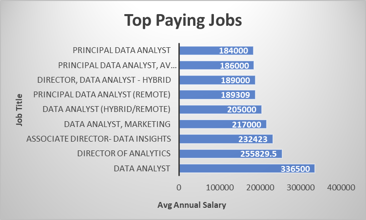
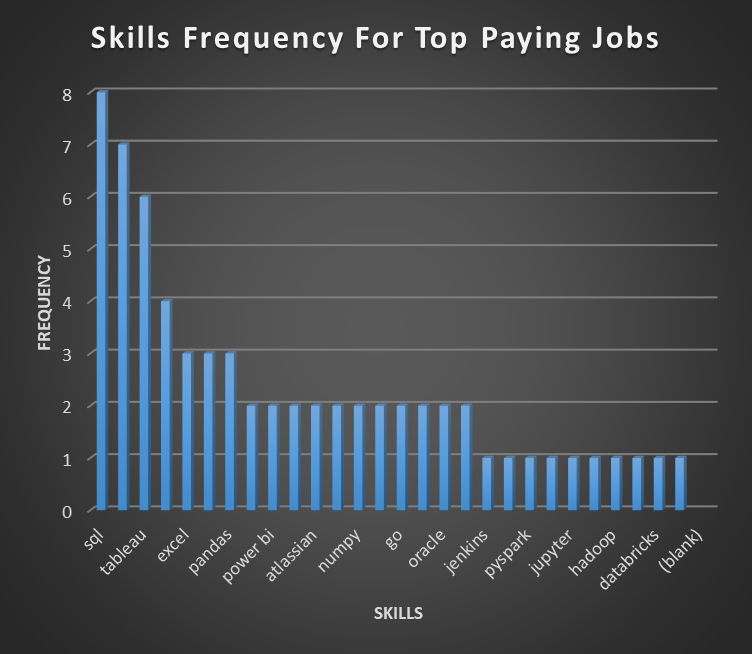

# INTRODUCTION
Welcome to my SQL capstone project, where curiosity met the job market and said; “Alright then… what skills are actually worth learning?”

This project dives into the data analyst job market to answer some very real questions every aspiring analyst has probably asked at least once:

- Which data analyst jobs actually pay well?
- What skills show up in those high-paying roles?
- Which skills are employers asking for the most?
- And most importantly…
What’s the sweet spot between high demand and high salary?

Using SQL, I explored job posting data to uncover trends around salary, skill demand, and market value in the data analytics space. The goal was to turn raw job market data into something more strategic and useful for career decision-making.

This project is part SQL analysis, part career intelligence, and part “let me stop guessing and actually look at the data.”

Whether you're a recruiter, hiring manager, fellow learner, or just another data nerd trying to figure out where the market is headed - this analysis offers a clean, data-driven snapshot of what matters most in the data analyst landscape.

Find SQL queries here: [Capstone_project folder](/sql_load/Capstone_project/)

# BACKGROUND
Breaking into data analytics can feel a little chaotic. There’s no shortage of advice online; learn SQL, build projects, maybe pick up Python, definitely know Excel, probably Tableau, maybe cloud, maybe not, and suddenly the “data analyst roadmap” starts looking less like a roadmap and more like a side quest with no map.

That uncertainty is exactly what inspired this project.

Rather than relying on generic career advice or random LinkedIn takes, I wanted to approach the job market the way an analyst should: with data. This project was built to explore what the market is actually rewarding - not just in terms of salary, but also in terms of skill demand and long-term career value.

At its core, this analysis is about one thing: making smarter learning and career decisions.

Using SQL, I analyzed job posting data to identify which roles pay the most, which skills employers consistently ask for, and where the strongest overlap exists between market demand and earning potential. Not just what looks impressive on a résumé, but what is strategically worth learning.

### This project was guided by five key questions:
- What are the top-paying roles within data analytics?
- What skills are required for these top-paying roles?
- What skills are most in demand in the data analyst job market?
- Which skills are associated with the highest average salaries?
- Which skills are the most optimal to learn (high demand + high paying)?

Data used was from [Luke Barousse](https://lukebarousse.com/sql)
# TOOLS I USED
This project was built using a core set of tools commonly used in real-world data workflows; from querying and analysis to version control and project sharing.

- **SQL** – The backbone of the entire analysis. Used to clean, filter, join, aggregate, and extract insights from the job market dataset.
- **PostgreSQL** – Used as the database management system for storing and querying the data efficiently.
- **Visual Studio Code (VS Code)** – My primary workspace for writing, editing, and executing SQL queries in a structured development environment.
- **Git** – Used for version control to track changes, manage progress, and maintain an organized workflow throughout the project.
- **GitHub** – Used to host the project, document the analysis, and share the final work as part of my data portfolio.
# THE ANALYSIS
With the project foundation in place, the next step was getting into the actual analysis. To make the findings clear and structured, I broke the project down into focused sections - each one designed to answer a specific question about the data analyst job market. From salary trends to skill demand, each query builds toward a bigger picture: understanding which roles pay the most, which skills matter most, and where the smartest opportunities exist for growth.
### 1. What are the top-paying data analyst jobs?
Money talks, and in this section, I wanted to hear exactly what the market was saying. This query focuses specifically on identifying the highest-paying remote data analyst roles, making it easier to see which opportunities sit at the top of the salary ladder. 

**SQL QUERY;**

```sql
SELECT
    jpf.job_id,
    jpf.job_title,
    jpf.job_location,
    jpf.salary_year_avg,
    jpf.job_via,
    jpf.job_posted_date,
    company_dim.name AS companies
FROM
    job_postings_fact AS jpf
JOIN
    company_dim ON company_dim.company_id = jpf.company_id
WHERE
    jpf.job_title_short = 'Data Analyst' AND 
    jpf.salary_year_avg IS NOT NULL AND
    jpf.job_location = 'Anywhere'
ORDER BY
    jpf.salary_year_avg DESC
LIMIT 10;
```
### Key Insights
- **Top-paying remote data analyst roles are mostly senior-level positions.**
Although one role is simply titled Data Analyst, most of the highest-paying jobs in the results are director-, associate director-, or principal-level roles, suggesting that higher salaries in analytics are strongly tied to experience, leadership, and strategic responsibility.
- **The highest-paying opportunities go beyond basic reporting and dashboard work.**
Many of the roles emphasize areas like data insights, marketing analytics, performance analysis, and decision support, showing that employers tend to pay more for analysts who can drive business strategy rather than just produce data outputs.
- **There is a significant salary outlier at the top of the dataset.** 
The $650,000 salary is far above the rest of the listed roles, while the remaining top jobs fall more consistently within the $184,000–$336,500 range. This suggests that extremely high-paying analyst roles exist, but are likely uncommon and should be interpreted cautiously.


*Graph Showcasing Data Analyst jobs with the top 10 annual salaries*

### 2. What skills are required for top-paying data analyst roles?

After identifying the highest-paying remote data analyst jobs, the next step was to look under the hood and see which skills kept showing up across those roles. This part of the analysis focuses on the tools, programming languages, platforms, and business intelligence skills associated with high-paying analyst positions. 

**SQL QUERY;**

```sql

WITH top_paying_jobs AS (
    SELECT DISTINCT
        jpf.job_id,
        jpf.job_title,
        jpf.job_location,
        jpf.salary_year_avg,
        company_dim.name AS companies
    FROM
        job_postings_fact AS jpf
    JOIN
        company_dim ON company_dim.company_id = jpf.company_id
    WHERE
        jpf.job_title_short = 'Data Analyst' AND 
        jpf.salary_year_avg IS NOT NULL AND
        jpf.job_location = 'Anywhere'
    ORDER BY
        jpf.salary_year_avg DESC
    LIMIT 10
)

SELECT
    tpj.*, 
    skills_dim.skills
FROM
    top_paying_jobs AS tpj
INNER JOIN
    skills_job_dim ON tpj.job_id = skills_job_dim.job_id
INNER JOIN
    skills_dim ON skills_job_dim.skill_id = skills_dim.skill_id
ORDER BY
    salary_year_avg DESC;
```
### Key Insights
- **SQL is the non-negotiable core skill.**
Across the top-paying roles, SQL appears consistently and more frequently than any other skill, making it the clearest baseline requirement for high-paying data analyst jobs. If there’s one skill this dataset refuses to let you ignore, it’s SQL.
- **Python, Tableau, and R form a strong high-value skill cluster.**
Beyond SQL, the most recurring skills include Python, Tableau, and R, suggesting that top-paying analyst roles often expect a mix of data querying, analysis/programming, and visualization rather than just one isolated capability.
- **High-paying analyst roles increasingly blend analytics with data infrastructure and business tools.**
Skills like AWS, Azure, Snowflake, Databricks, Oracle, Power BI, Jira, and Confluence show that these roles often sit at the intersection of analysis, cloud/data systems, and cross-functional business operations. In other words, top-paying analysts are often expected to work beyond spreadsheets and dashboards alone.


*Frequently requested skills across the highest-paying remote data analyst jobs*

### 3. What are the most in-demand skills for data analysts?

High salary is great, but demand matters too. A skill can pay well in theory and still be useless if barely anyone is hiring for it. This part of the analysis focuses on identifying the skills that appear most frequently across data analyst job postings, giving a clearer picture of what employers are consistently asking for in the market.

**SQL QUERY;**

```sql

SELECT
    skills_dim.skills,
    COUNT(jpf.job_id) AS job_demand_count
FROM
    job_postings_fact AS jpf
INNER JOIN
    skills_job_dim ON jpf.job_id = skills_job_dim.job_id
INNER JOIN
    skills_dim ON skills_job_dim.skill_id = skills_dim.skill_id
WHERE
    jpf.job_title_short = 'Data Analyst' AND
    jpf.job_location = 'Anywhere'
GROUP BY
    skills_dim.skills
ORDER BY
    job_demand_count DESC
LIMIT 5;
```
### Key Insights
- **SQL is by far the most in-demand skill in the data analyst job market.**
With 7,291 job postings, SQL stands well above every other skill in the dataset, reinforcing its position as the most essential technical skill for data analysts.
- **Foundational analytics tools still dominate hiring demand.**
Skills like Excel, Python, Tableau, and Power BI all appear frequently, showing that employers continue to value a combination of data handling, analysis, and visualization skills rather than just one technical niche.
- **Visualization and reporting tools remain highly relevant.**
The strong presence of Tableau and Power BI suggests that the ability to turn data into clear, actionable insights is still a major expectation for analyst roles.


| Skill     | Job Demand Count |
|-----------|------------------|
| SQL       | 7,291            |
| Excel     | 4,611            |
| Python    | 4,330            |
| Tableau   | 3,745            |
| Power BI  | 2,609            |

*Top 5 Technical Skills by Job Demand*

### 4. What are the top skills based on salary for data analysts?

While demand tells you which skills keep your resume in circulation, salary tells you which skills are valued most highly by employers. This section focuses on the average salary associated with each skill across the top-paying roles, helping identify technical capabilities that maximize financial reward in the data analyst market.

**SQL QUERY;**

```sql

SELECT
    skills_dim.skills,
   ROUND (AVG (salary_year_avg),0) AS avg_salary
FROM
    job_postings_fact AS jpf
INNER JOIN
    skills_job_dim ON jpf.job_id = skills_job_dim.job_id
INNER JOIN
    skills_dim ON skills_job_dim.skill_id = skills_dim.skill_id
WHERE
    jpf.job_title_short = 'Data Analyst' AND
    jpf.job_location = 'Anywhere' AND
    jpf.salary_year_avg IS NOT NULL
GROUP BY
    skills_dim.skills
ORDER BY
    avg_salary DESC
LIMIT 30;
```
### Key Insights
- **Advanced data engineering and cloud skills command the highest salaries.**
Skills like PySpark ($208k), Bitbucket ($189k), and Databricks ($141k) suggest that roles touching big data pipelines, cloud architecture, and scalable analytics are the top-paying positions in the dataset.
- **Programming and analytics tools are consistently lucrative.**
Core analytical tools such as Python (via Jupyter, Pandas), Golang, NumPy, and Swift appear among the highest-paying skills, showing that employers reward analysts who can code, manipulate, and process data efficiently.
- **Specialized platforms and machine learning skills add salary premium.**
Skills like Watson, DataRobot, Scikit-learn, and Elasticsearch show that having experience with ML platforms or search/indexing engines can meaningfully boost compensation, emphasizing the value of specialization in high-paying roles.

The dataset suggests that the highest-paying roles reward both programming/data engineering expertise and experience with specialized platforms or tools. This indicates that to maximize earning potential, analysts should combine core analytics skills (SQL, Python, Pandas) with advanced, niche technologies like PySpark, cloud platforms, or ML tools.

### 5. What are the most optimal skills for data analysts?

This final section combines demand and compensation to identify the skills that are not only frequently sought after but also command top salaries. By focusing on these optimal skills, aspiring analysts can maximize both job security and earning potential, giving them a clear roadmap for strategic career development.

**SQL QUERY;**

```sql
WITH In_demand_skills AS (
    SELECT
        skills_dim.skills AS Skills,
        COUNT(jpf.job_id) AS job_demand_count,
        AVG (salary_year_avg) AS avg_salary
    FROM
        job_postings_fact AS jpf
    INNER JOIN
        skills_job_dim ON jpf.job_id = skills_job_dim.job_id
    INNER JOIN
        skills_dim ON skills_job_dim.skill_id = skills_dim.skill_id
    WHERE
        jpf.job_title_short = 'Data Analyst' AND
        jpf.job_location = 'Anywhere' AND
        jpf.salary_year_avg IS NOT NULL
    GROUP BY
        skills_dim.skills
    ORDER BY
        job_demand_count DESC
)

SELECT
    job_demand_count,
    Skills,
    ROUND (avg_salary,0) AS avg_salary
FROM
    In_demand_skills
WHERE
    job_demand_count > 10
ORDER BY
    job_demand_count DESC,
    avg_salary DESC;
```
### Key Insights
- **SQL, Python, and Tableau remain unbeatable foundations.**
These skills appear consistently high in demand while also offering strong salaries ($97k–$101k), confirming that core analytics capabilities continue to dominate the market.
- **Cloud, big data, and specialized platforms deliver a premium.**
Skills like AWS ($108k), Snowflake ($113k), Azure ($111k), Hadoop ($113k), and Go ($115k) show that combining high-demand foundational skills with advanced data platforms can significantly increase earning potential.
- **Niche but highly paid skills are worth strategic focus.**
Skills like Confluence ($114k), BigQuery ($109k), Oracle ($104k), and Jira ($104k) may have lower overall demand but offer substantial pay premiums, making them attractive for analysts aiming for specialized, high-reward roles.

| Skill   | Job Demand Count | Average Salary (USD) |
|---------|-----------------|--------------------|
| SQL     | 398             | 97,237             |
| Excel   | 256             | 87,288             |
| Python  | 236             | 101,397            |
| Tableau | 230             | 99,288             |
| R       | 148             | 100,499            |

*Top 5 Optimal skills for Data Analysts*
# WHAT I LEARNED
Through this project, I developed both technical proficiency and a stronger analytical mindset. Writing and refining basic, advanced, and complex SQL queries in VS Code taught me not just how to code efficiently, but also how to think critically about data structure and interpretation. The iterative process of testing and improving queries strengthened my problem-solving skills and highlighted the importance of precision in extracting meaningful insights. Ultimately, the project allowed me to analyze the data analysis job market and identify the most in-demand and highest-paying skills, demonstrating the practical impact of careful data analysis.

### Key Lessons Learned:

- Mastery of SQL query types: basic, advanced, and complex.
- Efficient navigation, editing, and execution in VS Code.
- Analytical iteration: refining queries to ensure accurate, actionable outputs.
- Translating data insights into practical understanding of industry trends.
- Appreciation for persistence and precision in problem-solving.
# CONCLUSION

- **SQL remains the most in-demand technical skill** for data analysis roles, with the highest number of job postings in the dataset.
- **Python and Tableau are highly valued for advanced analytics**, offering both strong demand and above-average salaries, showing the market prioritizes versatile analytical tools.
- **Excel remains a foundational skill**, widely required across roles, but it is associated with slightly lower average salaries compared to programming and visualization-focused tools.
- **R is niche but high-paying**, indicating specialized statistical and analytical expertise is valued for certain analytical roles.
- **Data-driven decision-making relies on a combination of technical skill and analytical interpretation**, highlighting that mastery of complex queries and the ability to extract actionable insights provides a strategic advantage in the job market.


